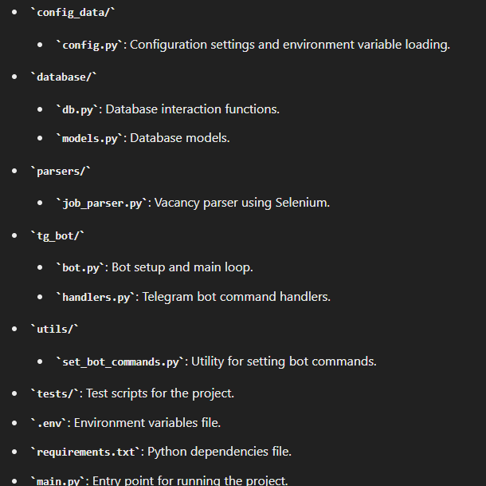

# Vacancy Parser and Telegram Bot Project

This project combines a vacancy parser and a Telegram bot to fetch and provide vacancy statistics.

## Prerequisites

- Python 3.8 or higher
- Virtual environment (venv)

## Installation

### Step 1: Create a Virtual Environment

Create a virtual environment to isolate the project's dependencies:
```sh
python -m venv venv
```

### Step 2: Activate the Virtual Environment
Activate the virtual environment:
    
#### For Windows:
```sh 
venv\Scripts\activate
```
#### For macOS/Linux:

```sh
source venv/bin/activate
```
### Step 3: Install Dependencies
Install the required dependencies using the requirements.txt file:
```sh 
pip install -r requirements.txt
```
## Configuration
### Step 4: Set Up Environment Variables
Create a .env file in the root directory of the project and add the following variables:

```makefile
TELEGRAM_BOT_TOKEN=#YOUR_TOKEN
DATABASE_URI=sqlite:///vacancies.db # you can change the name of database
ROBOTA_URL=https://robota.ua/ru/zapros/junior/ukraine #better not change
```

## Usage
### Step 5: Run the Project
To run the project, execute the following command:
```sh 
python main.py
```
This command will start both the vacancy parser and the Telegram bot simultaneously.

## Project Structure


## Functionality
### Vacancy Parser
Fetches the number of vacancies from the specified URL using Selenium.
Stores vacancy data in an SQLite database.
## Telegram Bot
Responds to user commands to provide statistics about vacancies.
Sends an Excel file with today's vacancy statistics.
## Example Commands
/start: Start the bot.

/help: Display help information.

/get_today_statistic: Get today's vacancy statistics.

## Contributions
Contributions are welcome! Feel free to submit a pull request or open an issue to improve the project.

## License
This project is licensed under the MIT License. See the [LICENCE](LICENCE) file for details.

## Acknowledgements
Special thanks to all contributors and open-source projects that made this project possible.
Note: Ensure you have the appropriate permissions to access and use the specified URLs and APIs in the project.